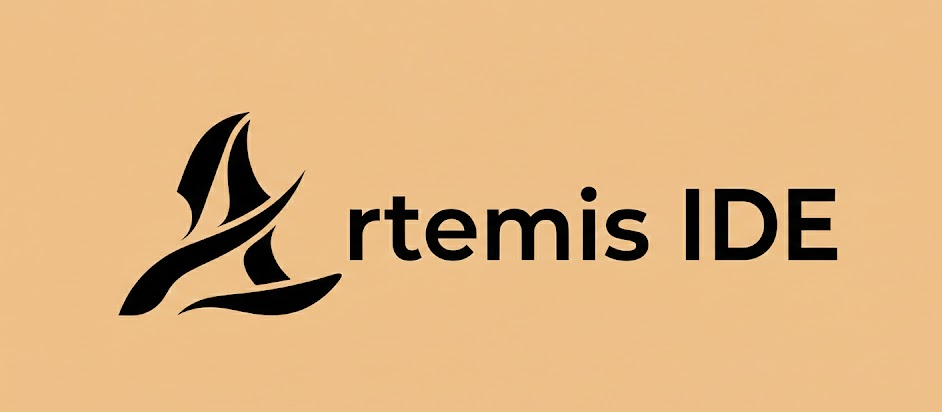
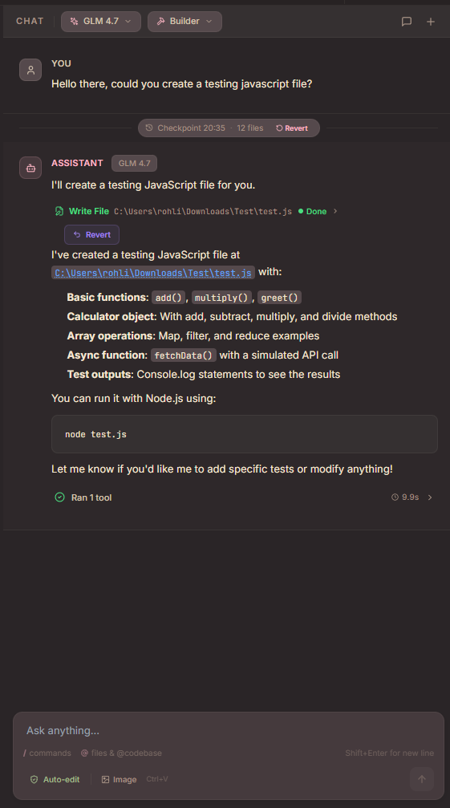
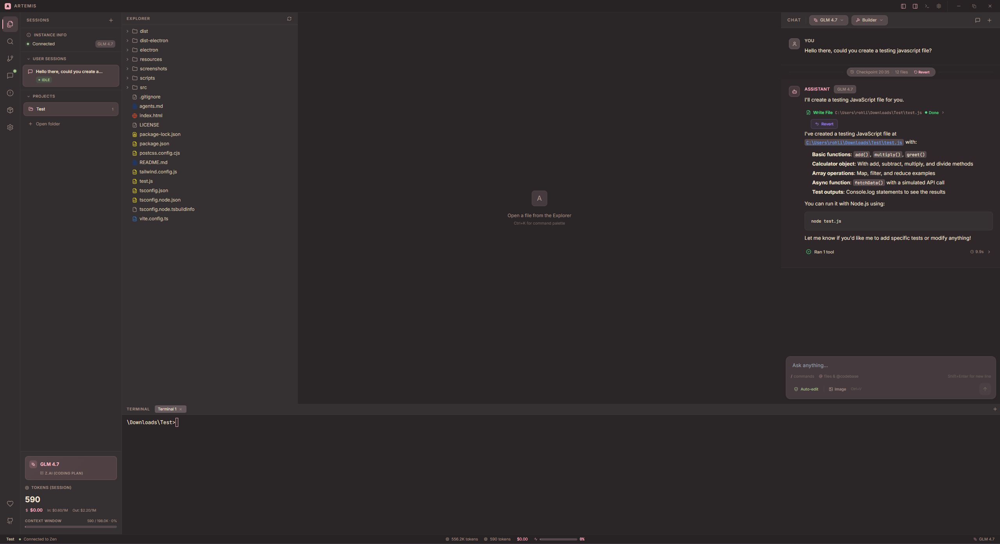
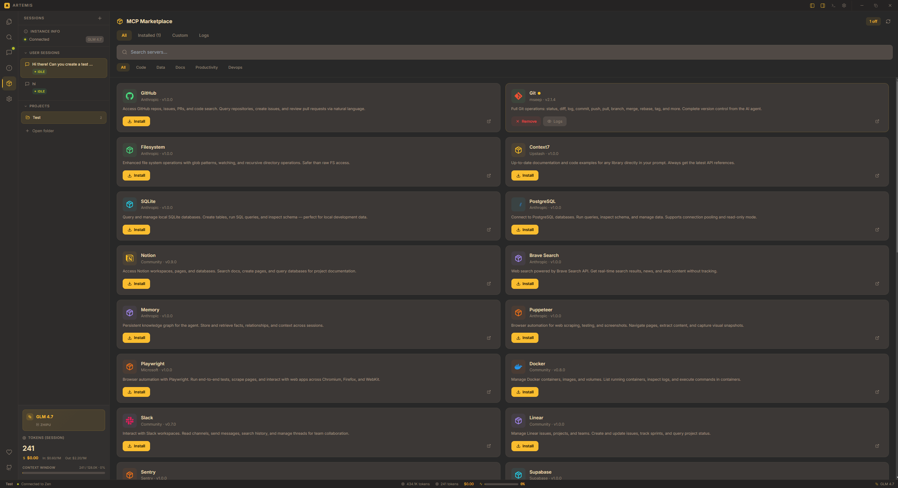
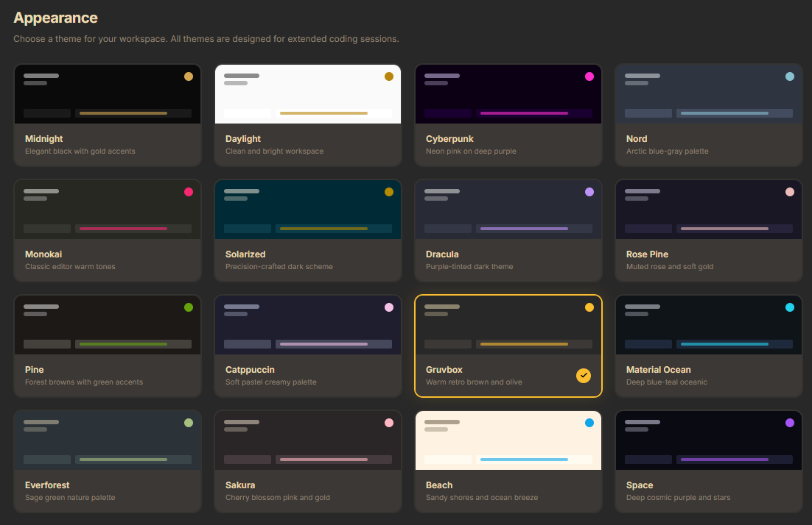

<div align="center">



# Artemis IDE

**An open-source, AI-powered desktop IDE with autonomous agents, local-first controls, and built-in developer tools.** ⚡

[](LICENSE)
[](https://electronjs.org/)
[](https://react.dev/)
[](https://typescriptlang.org/)
[](https://tailwindcss.com/)

[Support the project](https://buymeacoffee.com/foxemsx) | [GitHub](https://github.com/Foxemsx/Artemis)

</div>

---

## Overview

Artemis is a personal, open-source IDE built around AI-assisted development. It combines a familiar editor experience with autonomous agent workflows, inline completions, integrated terminal sessions, source control, MCP tools, and a security model that keeps user approval at the center.

The goal is simple: let AI help with real development work without turning the IDE into a black box. Agents can inspect files, suggest changes, run approved tools, and work across a project while every sensitive action remains visible and controlled.

> [!NOTE]
> Artemis is primarily a personal project. It is free to use, fork, and modify under the MIT license, but updates and long-term maintenance are not guaranteed.

## Highlights

- 🤖 **Autonomous AI agent** with Builder, Planner, Chat, and Ask modes.
- 🧠 **13 AI providers** including OpenAI, Anthropic, Google Gemini, DeepSeek, Groq, Mistral, OpenRouter, Z.AI, Zen, Perplexity, Synthetic, Moonshot, and Ollama.
- 📝 **Monaco editor** with multi-tab editing, syntax highlighting, diagnostics, and quick fixes.
- 💻 **Integrated terminal** powered by xterm.js and node-pty.
- 🌿 **Git support** with staging, diffs, commits, and source-control workflows.
- 🔌 **MCP marketplace** for installing and managing external tools.
- 🔒 **Workspace Trust** and approval prompts for sensitive operations.
- 🎨 **Themes, inline completions, checkpoints, token tracking, and Discord Rich Presence.**

## Screenshots

| AI Chat | Editor |
|:---:|:---:|
|  |  |

| MCP Marketplace | Themes |
|:---:|:---:|
|  |  |

## Agent Modes

| Mode | Purpose |
|:---|:---|
| **Builder** | Autonomous coding mode with access to the full toolset after approval. |
| **Planner** | Creates structured implementation plans before changes are made. |
| **Chat** | Conversational help with limited tool usage. |
| **Ask** | Fast read-only Q&A for project context and explanations. |

Agents can use file context, `@mentions`, image attachments, project search, web search, URL fetching, linting, Git diff inspection, and controlled command execution.

## Security Model 🔒

Artemis treats agent actions as untrusted until validated. The main security boundaries include:

| Area | Protection |
|:---|:---|
| **File access** | Path validation, project containment, traversal checks, and read limits. |
| **File changes** | Write, delete, move, directory creation, and command tools require approval. |
| **Commands** | Restricted executables, blocked shell metacharacters, no shell execution, timeouts, and output limits. |
| **Network access** | Allowed API domains and SSRF protection for URL fetching. |
| **Secrets** | API keys are stored with Electron `safeStorage` when available. |
| **Renderer isolation** | Electron sandboxing and context isolation are enabled. |
| **Workspace Trust** | Untrusted folders run with reduced capabilities. |

## Core Features

### AI and Providers

- Provider adapters for OpenAI, Anthropic, OpenAI-compatible APIs, and local Ollama models.
- Model metadata for 200+ models.
- Vision-capable workflows through image attachments.
- Token tracking and cost estimation.
- Inline ghost-text completion.
- AI-generated commit messages.

### IDE Experience

- Monaco Editor with project-aware editing.
- File explorer with create, rename, delete, and context actions.
- Multi-tab workflow with pinned and preview tabs.
- Problems panel with TypeScript diagnostics.
- Integrated PTY terminal sessions.
- Command palette via `Ctrl+Shift+P`.
- Configurable sounds and Discord Rich Presence.

### MCP Marketplace

Artemis includes a curated MCP marketplace and custom server support. Built-in categories include:

- Code and repository tools: GitHub, Git, Filesystem, Context7.
- Databases: SQLite and PostgreSQL.
- Browser automation: Puppeteer and Playwright.
- Productivity: Notion, Memory, Brave Search.
- DevOps: Docker and related workflow tools.

You can install curated servers with one click or add custom servers with your own environment configuration.

### Themes

Artemis includes 16 built-in themes:

Dark, Light, Cyberpunk, Nord, Monokai, Solarized, Dracula, Rose Pine, Pine, Catppuccin, Gruvbox, Material Ocean, Everforest, Sakura, Beach, and Space.

## Architecture

Artemis uses Electron's main and renderer process split:

```text
electron/
  main.ts                 Main process, IPC handlers, store, terminal sessions
  preload.ts              Secure context bridge exposed as window.artemis
  api/
    agent/                Agent loop and stream parsing
    conversation/         Conversation persistence
    ipc/                  Agent IPC handlers
    providers/            AI provider adapters
    tools/                Tool registry and executor
  services/               Checkpoints, MCP, linting, web search, completions
  shared/                 Security helpers and logging

src/
  components/             React UI components
  hooks/                  App state, sessions, themes, token tracking
  lib/                    Model registry, formatters, checkpoints, utilities
  styles/                 Tailwind and theme CSS
```

## Tech Stack

| Layer | Technology |
|:---|:---|
| Desktop | Electron 35 |
| Frontend | React 18.2 and TypeScript 5.3 |
| Styling | Tailwind CSS 3.4 |
| Editor | Monaco Editor 0.52 |
| Terminal | xterm.js 5.4 and node-pty 1.1 |
| Animation | Framer Motion 10 |
| Icons | Lucide React |
| Build | Vite 5 and electron-builder |

## Getting Started 🚀

### Requirements

- Node.js 18 or newer
- npm
- Git

### Installation

```bash
git clone https://github.com/Foxemsx/Artemis.git
cd Artemis
npm install
npm run dev
```

### Production Build

```bash
npm run build
```

Platform packages can be created with:

```bash
npm run dist
npm run dist:win
npm run dist:mac
npm run dist:linux
```

## Development

| Command | Description |
|:---|:---|
| `npm run dev` | Start the Vite development server for Electron. |
| `npm run build` | Create a production build. |
| `npm run build:icons` | Generate application icons. |
| `npm run dist` | Build and package the app with electron-builder. |
| `npm run dist:win` | Build a Windows package. |
| `npm run dist:mac` | Build a macOS package. |
| `npm run dist:linux` | Build a Linux package. |

## Project Status

Artemis is actively shaped by personal use. Contributions, forks, experiments, and feedback are welcome, but this repository should be treated as an independent open-source project rather than a commercial product with a fixed support roadmap.

## Acknowledgments

Artemis is built with excellent open-source projects:

| Project | Role |
|:---|:---|
| [Electron](https://electronjs.org/) | Desktop application framework |
| [React](https://react.dev/) | User interface framework |
| [Monaco Editor](https://microsoft.github.io/monaco-editor/) | Code editor |
| [xterm.js](https://xtermjs.org/) | Terminal emulator |
| [node-pty](https://github.com/microsoft/node-pty) | Pseudoterminal support |
| [Tailwind CSS](https://tailwindcss.com/) | Styling |
| [Framer Motion](https://www.framer.com/motion/) | UI animation |
| [Lucide](https://lucide.dev/) | Icons |
| [Vite](https://vitejs.dev/) | Build tooling |

## License

Artemis is released under the [MIT License](LICENSE). You may use, modify, distribute, and build on it, provided the license and copyright notice are included.

## Connect

- GitHub: [Foxemsx/Artemis](https://github.com/Foxemsx/Artemis)
- Support: [Buy Me a Coffee](https://buymeacoffee.com/foxemsx)
- Discord: `767347091873595433`

<div align="center">


**Built by [Foxemsx](https://github.com/Foxemsx).**

</div>
